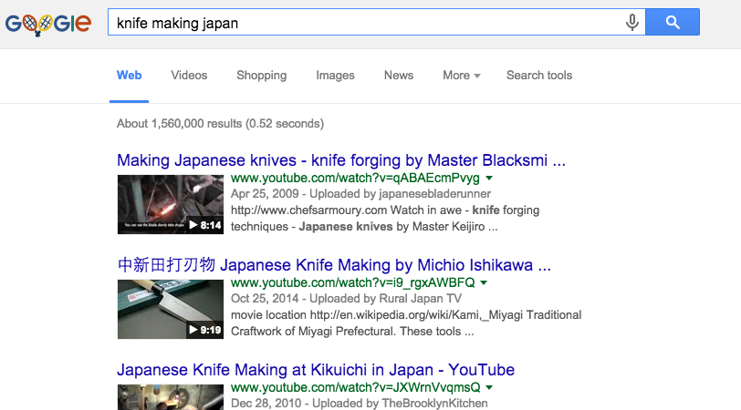

# 1. Introduction to Search Engine Optimization

1. [What is Search Engine Optimization (SEO)?](#what)
2. [Where does SEO apply?](#where)
3. [Can every business benefit from SEO?](#everyone)
4. [What about pay-per-click (PPC) advertising?](#ppc)

## What is Search Engine Optimization (SEO)?

Search Engine Optimization is the process of positioning a website or URL as high on the Search Engine Results Page (SERP) as possible for a particular keyword. As an example, you might want to have a [Japanese Knife Making Youtube Video](https://www.youtube.com/watch?v=qABAEcmPvyg) show up at the top of Google's SERP for the keyword "Knife Making of Japan". Using SEO, you will use on-site and off-site techniques to rank that video for the associated keyword or keywords.

## Where does SEO apply?

Details

## Can every business benefit from SEO?

Details

## What about pay-per-click (PPC) advertising?

Details
